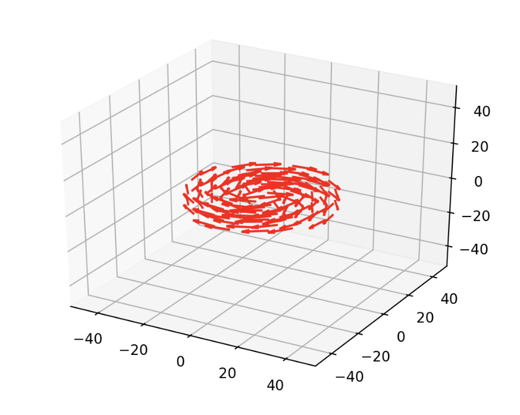
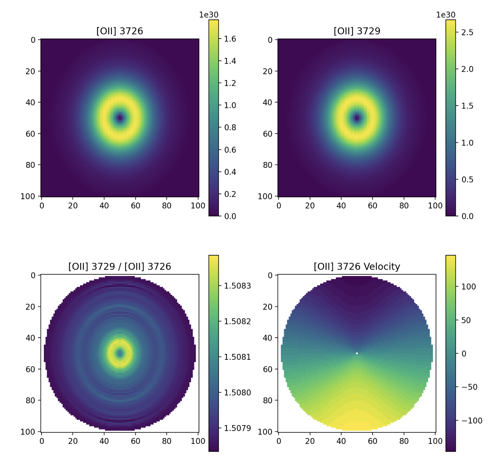
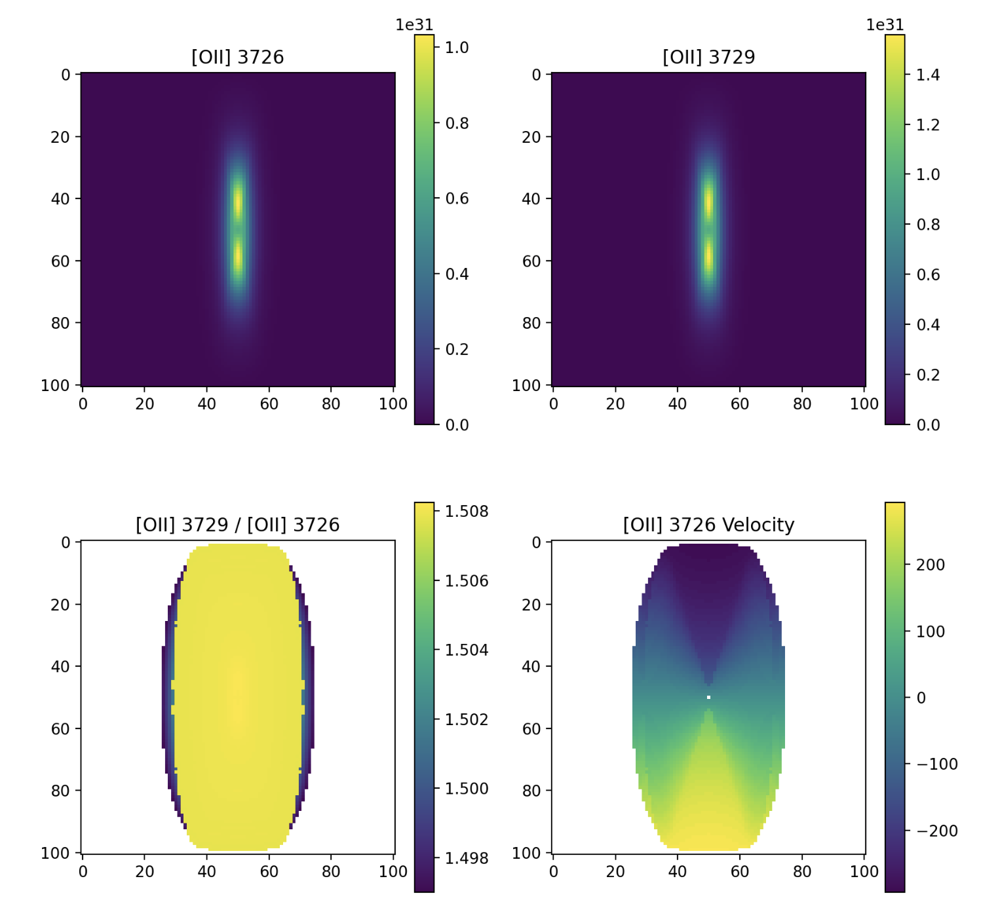

# Cloudy3D Simulation

## Step 1

For a Sersic disk with a circular velocity defined by the potential of the galactic halo and the disk, I will generate the line emission surface brightness, velocity when viewed face-on and edge-on. Especially I will include emissions of MgII, [OII], [NeIII], [NeV], [OIII] and H-beta.

The velocity of the disk is as follows.

 

## Step 2

